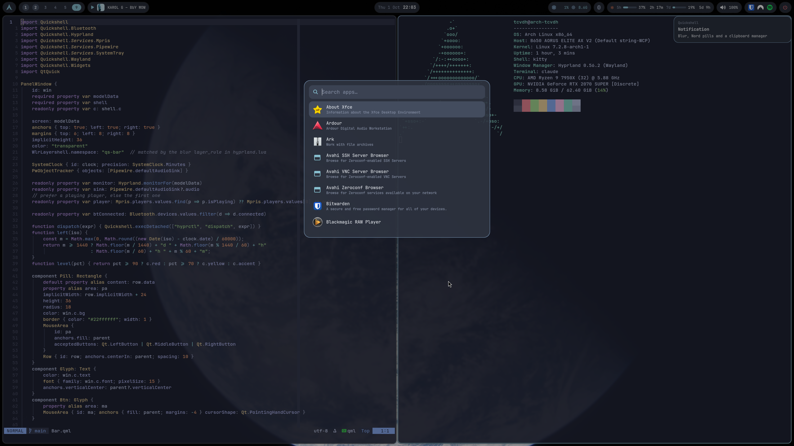

# Dotfiles

Arch Linux + Hyprland, with a custom [Quickshell](https://quickshell.org) shell in Nord colours.

## What's here
| Path | What |
|---|---|
| `hypr/` | Hyprland (Lua config) and hyprlock |
| `quickshell/` | Bar, app launcher, power menu, notifications, clipboard history, emoji picker, Bluetooth |
| `kitty/` | Terminal |
| `pipewire/`, `wireplumber/` | Audio |
| `waypaper/`, `btop/`, `fastfetch/`, `mpv/`, `Thunar/`, `xfce4/`, `autostart/` | App configs |

Neovim lives in its own repo: [init.lua](https://github.com/tcvdh/init.lua).

## Quickshell highlights
- **Bar** on both monitors: workspaces, media (click = play/pause, right-click = next), CPU/RAM, Claude usage limits, tray, volume, Bluetooth.
- **Launcher** (`SUPER+R`): apps, `>` actions, `;` clipboard history, `:` emoji.
- **Clipboard history** via `cliphist`, including Neovim yanks (also over SSH via OSC 52).
- **Notifications** and **power menu**, with blur behind everything.

## Use
Needs `hyprland`, `quickshell`, `jq`, `curl`, `cliphist`, `wl-clipboard` and a Nerd Font.
Clone into `~/.config` (the `.gitignore` only tracks the folders above).
